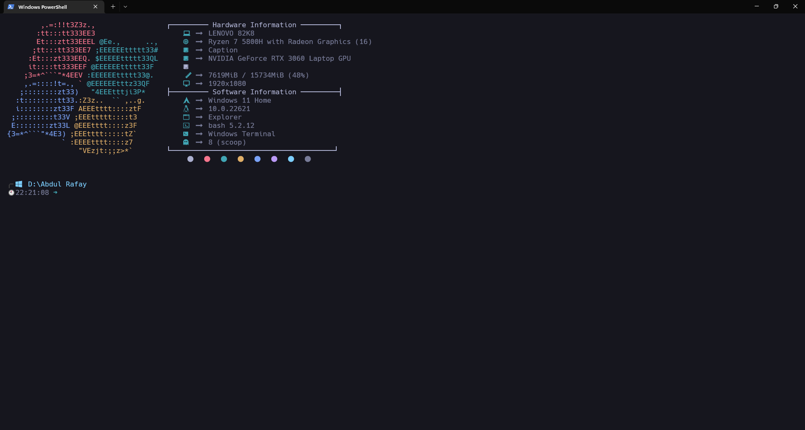
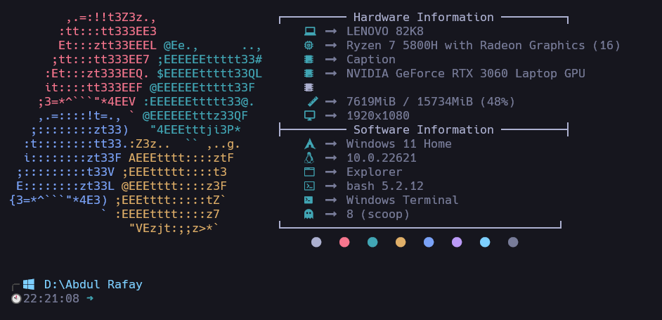
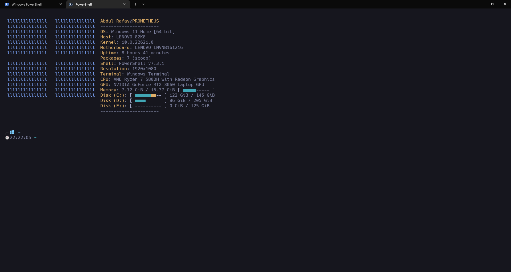
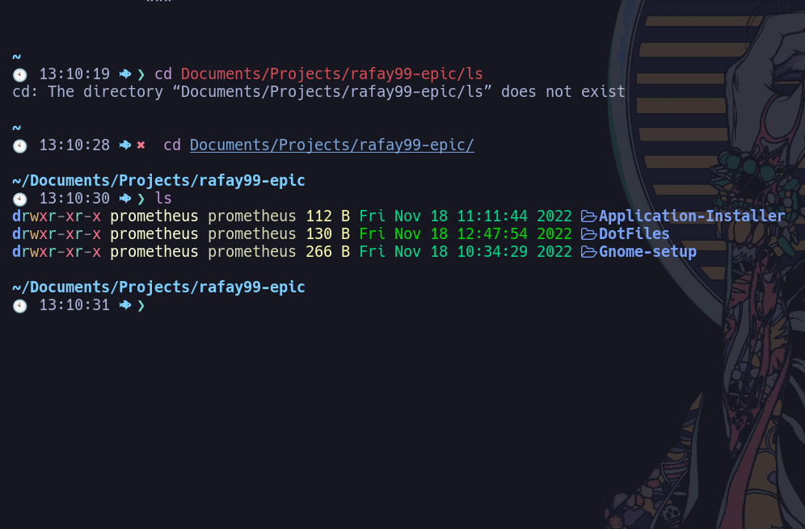

# Introduction:
In this repository, you can different config files for Windows. 

# Applications
Different Applications have different config files and all of the application are stared bellow.

## Windows Applications:
The following applications are installed on Windows:
  
    1. Powershell 7
    2. Windows Terminal
    3, Neofetch
    4. Microsoft Powershell 5
    5. Starship Promote
    6. lsd
    7. Winfetch

## Fonts:
These are some of the fonts that are need to make this config file work. These are the fonts: 

    1. Cascadia Code
    2. Fira Code
    3. Hack Nerd Font
    4. Ubuntu Mono
    5. Ubuntu Nerd Font
All these fonts are in this repository.

# License:
This repository is licensed under the MIT License. You can find the license in the [LICENSE](./LICENSE) file.

# Screen Shots:
## Window Terminal:
### Image 01:

### Image 02:

## Neofetch:

## Winfetch

## lsd:

# Issue:
- If you find any issue in this repository, you can open an issue. I will try to fix the issue as soon as possible.
- Use the [Issue template](/.github/ISSUE_TEMPLATE/bug_report.md) so that we can replicate the issue and fix it.
# Feature Request:
- If you want to request a feature, you can open an issue. I will try to add the feature as soon as possible.
- Use the [Feature Request template](/.github/ISSUE_TEMPLATE/feature_request.md) so that we can add the feature. 

# Contact:
- Name: Abdul Rafay
- Email: 99marafay@gmail.com
- Website: [rafay99.info](https://rafay99.info)
- Blog website: [rafay blogs](https://rafayblogs.tech)

